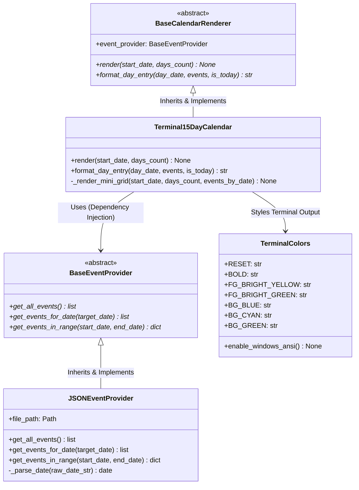

# Project Documentation: ABC Model, Inheritance & 15-Day Terminal Calendar

---

## 1. Overview & Objectives

This project implements an **Abstract Base Class (ABC)** architecture and **Object-Oriented Inheritance** in Python. It includes a dedicated terminal application ([`upcoming_calendar.py`](file:///d:/python-class/upcoming_calendar.py)) that:
- Generates a **15-day forward-looking calendar view** starting from today's date.
- Dynamically loads scheduled event dates from [`calendar_events.json`](file:///d:/python-class/calendar_events.json).
- **Highlights event dates** with bright ANSI terminal colors and displays event details under corresponding dates.
- Highlights the current day (`TODAY`) with a distinct colored badge.
- Follows the **Abstract Base Class (ABC)** design pattern with clear separation between data retrieval (`BaseEventProvider`) and interface rendering (`BaseCalendarRenderer`).

---

## 2. Theoretical Concepts: ABC Model & Inheritance

### 2.1 What is an Abstract Base Class (ABC)?
An **Abstract Base Class** is a class that cannot be instantiated on its own. It serves as a blueprint (or interface contract) for subclasses:
- Defined by inheriting from `abc.ABC`.
- Uses the `@abstractmethod` decorator from the built-in `abc` module.
- If a subclass fails to implement any `@abstractmethod`, Python raises a `TypeError` upon attempted instantiation.

```python
from abc import ABC, abstractmethod

class BaseService(ABC):
    @abstractmethod
    def perform_action(self) -> None:
        """Subclasses MUST implement this method."""
        pass
```

### 2.2 Why Use ABCs and Inheritance?
1. **Enforced Contract**: Ensures all derived classes implement required methods with consistent signatures.
2. **Polymorphism**: Allows interchangeable components (e.g., swapping `JSONEventProvider` for `DatabaseEventProvider` or `APIEventProvider` without changing the renderer).
3. **Code Reusability**: Common logic resides in the base class, while specific implementations live in subclasses.
4. **Decoupling**: Decouples the presentation layer (`BaseCalendarRenderer`) from the data storage layer (`BaseEventProvider`).

---

## 3. Architecture & Class Hierarchy



---

## 4. Module Breakdown

### 4.1 Data Provider: [`BaseEventProvider`](file:///d:/python-class/upcoming_calendar.py#L86-L103) & [`JSONEventProvider`](file:///d:/python-class/upcoming_calendar.py#L106-L167)
- **`BaseEventProvider` (ABC)**:
  - Defines the abstract contract for fetching events across any data source.
  - Abstract methods: `get_all_events()`, `get_events_for_date()`, and `get_events_in_range()`.
- **`JSONEventProvider` (Concrete Class)**:
  - Inherits from `BaseEventProvider`.
  - Reads event records from [`calendar_events.json`](file:///d:/python-class/calendar_events.json).
  - Handles JSON decoding, missing file fallbacks, and safe ISO date parsing (`YYYY-MM-DD`).

### 4.2 Renderer: [`BaseCalendarRenderer`](file:///d:/python-class/upcoming_calendar.py#L170-L191) & [`Terminal15DayCalendar`](file:///d:/python-class/upcoming_calendar.py#L194-L305)
- **`BaseCalendarRenderer` (ABC)**:
  - Defines the abstract contract for rendering a multi-day calendar view.
  - Requires implementing `render()` and `format_day_entry()`.
- **`Terminal15DayCalendar` (Concrete Class)**:
  - Inherits from `BaseCalendarRenderer`.
  - Enables ANSI Virtual Terminal processing on Windows.
  - Renders:
    1. **Header Banner**: Summarizes date range and total upcoming event count.
    2. **15-Day Compact Strip**: A horizontal visual matrix indicating today (`T`) and event days (`*`).
    3. **Day-by-Day Schedule**:
       - Days with events: Colored in **Bright Yellow** and **Bright Green** with an `[EVENT: N]` badge and indented event titles and descriptions.
       - Days without events: Displayed in clean, subtle text with a `(No events scheduled)` indicator.
       - Today's date: Highlighted with a distinct `TODAY` badge.

### 4.3 Color Styling: [`TerminalColors`](file:///d:/python-class/upcoming_calendar.py#L36-L83)
- Encapsulates ANSI terminal escape codes for cross-platform styling.
- Contains helper `enable_windows_ansi()` to configure Windows Virtual Terminal sequences.

---

## 5. Data Format ([`calendar_events.json`](file:///d:/python-class/calendar_events.json))

The event file contains a list of JSON objects with the following schema:
```json
[
  {
    "title": "Have lunch",
    "date": "2026-09-08",
    "description": "Get chicken biryani",
    "created_at": "2026-09-04T11:00:00"
  },
  {
    "title": "Complete project documentation",
    "date": "2026-09-12",
    "description": "Finalize ABC class diagrams",
    "created_at": "2026-09-04T11:00:00"
  }
]
```

---

## 6. How to Run

### Option A: From the Main Launcher Menu ([`test.py`](file:///d:/python-class/test.py))
Run the central launcher:
```bash
python test.py
```
Select **Option 3** (`View upcoming 15-day calendar`).

### Option B: Run Standalone
Run the 15-day terminal calendar directly:
```bash
python upcoming_calendar.py
```

### Custom Date Range Usage (Python Code Example)
You can also import and use the classes programmatically:

```python
from datetime import date
from upcoming_calendar import JSONEventProvider, Terminal15DayCalendar

# 1. Instantiate the provider (reading from calendar_events.json)
provider = JSONEventProvider("calendar_events.json")

# 2. Instantiate the renderer
calendar_view = Terminal15DayCalendar(provider)

# 3. Render 15 days starting from any date
calendar_view.render(start_date=date.today(), days_count=15)
```

---

## 7. Summary of Benefits

| Feature | Without ABC | With ABC & Inheritance |
| :--- | :--- | :--- |
| **Extensibility** | Hardcoded JSON reading inside UI code | Swap data sources (`Database`, `API`) by implementing `BaseEventProvider` |
| **Interface Guarantees** | Runtime attribute errors if methods differ | Immediate `TypeError` during instantiation if contract is violated |
| **Modularity** | Monolithic script | Clean separation of concerns (Data Provider vs Renderer) |
| **Testability** | Hard to mock file system | Easy to inject mock providers inheriting from `BaseEventProvider` |
